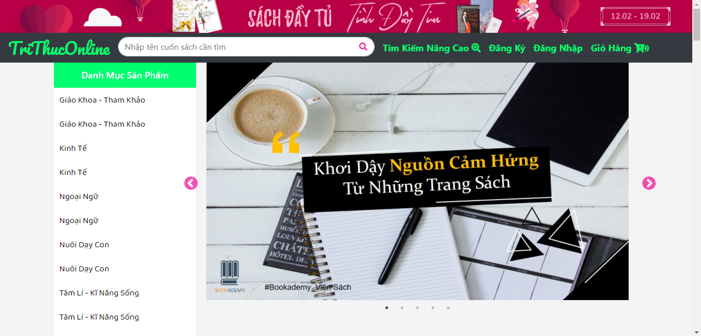
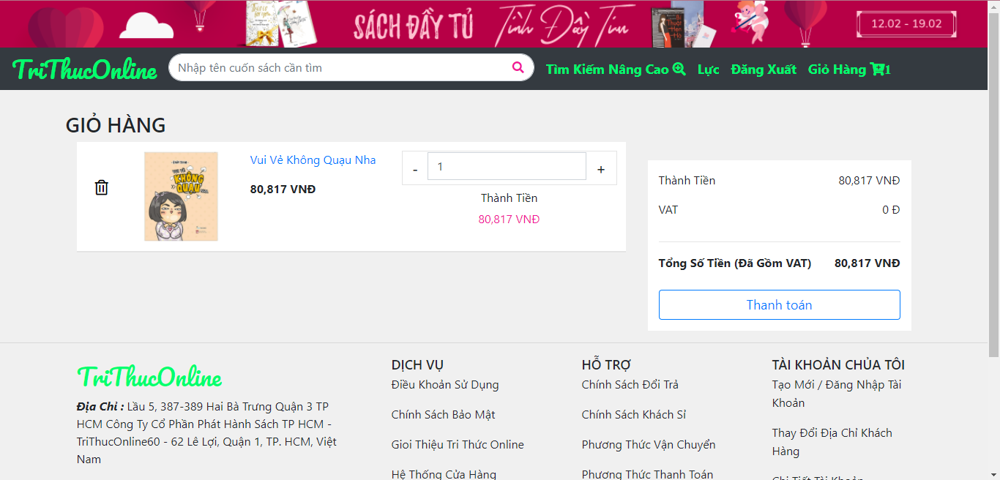
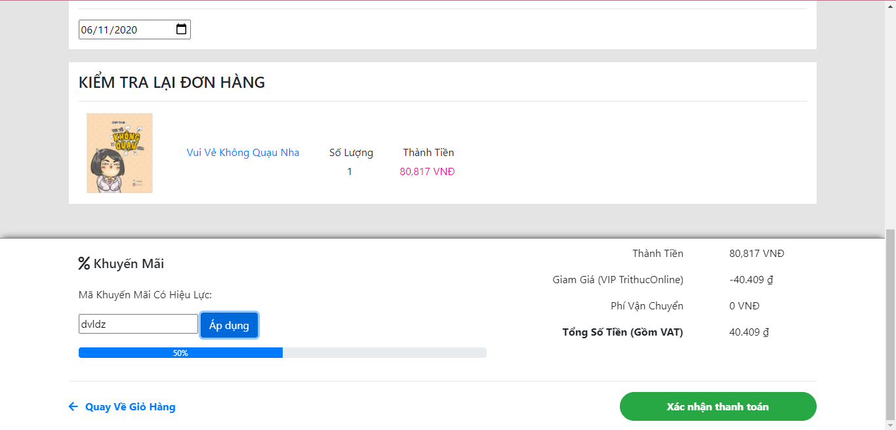
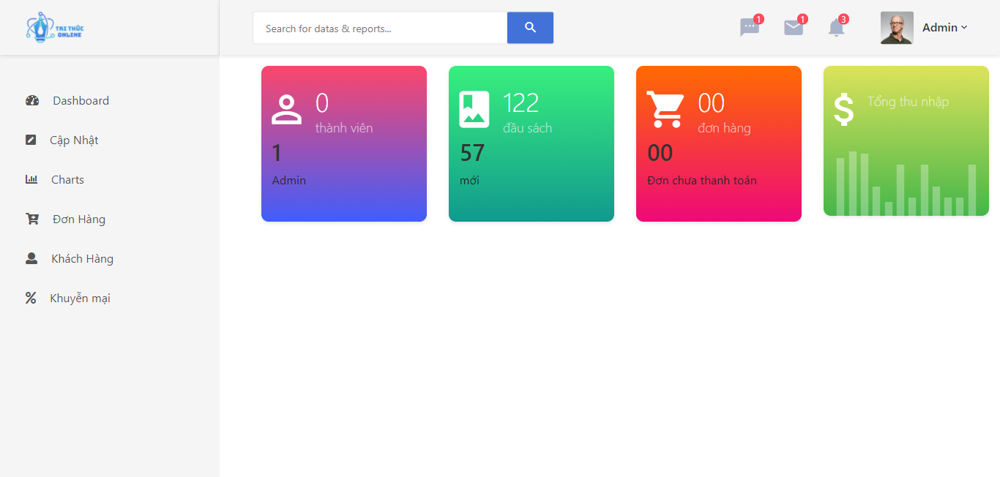
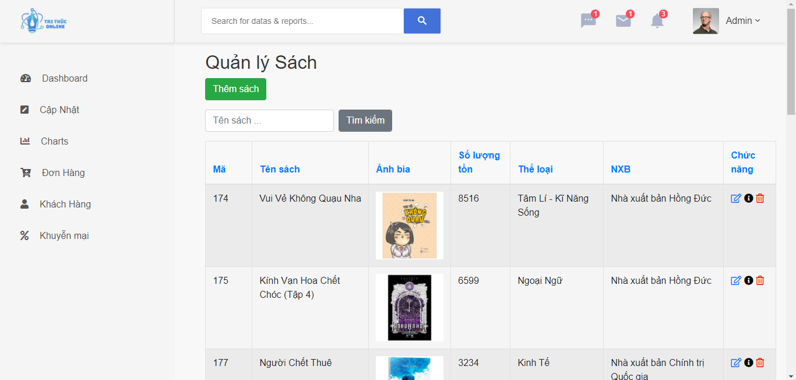

# Online-Bookstore
An ASP.NET web app developed with Le Quy Don Technical University, written in C# using Visual Studio. 
Functionalities include login, shopping cart, searching, adding and updating books, file upload (book image), and identity authentication.

## Screenshots

## Contributors
- **tuyenvdt:** Adding of new book to inventory (with validation and file upload features), Update Inventory, Book details, Home page (CSS), Integration..
- **mrl8199:** Checkout, Login, Site master, Update Inventory, Admin site, Integration..

## Running the project
- Import the database BookShop.bak into SSMS 
- Open the .sln file to open the ASP.NET project in Visual Studio. Click run (on development server)
